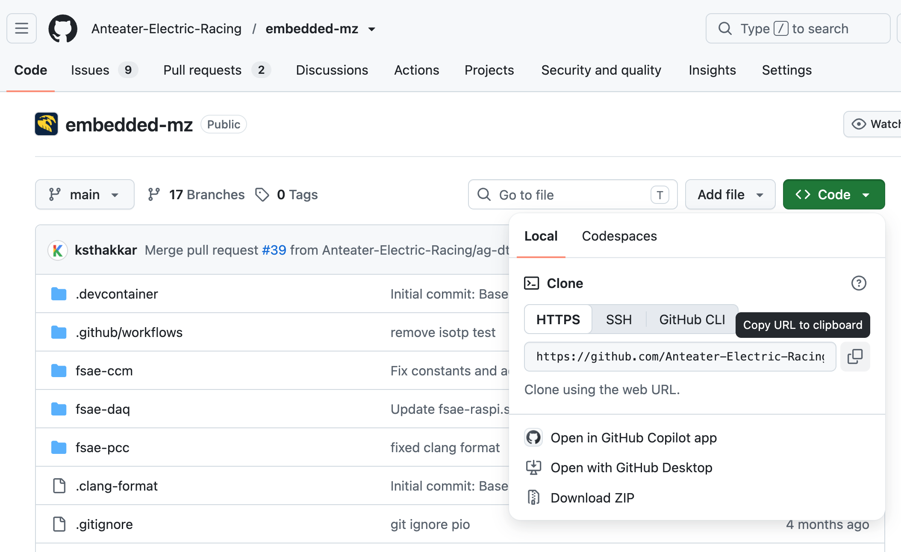
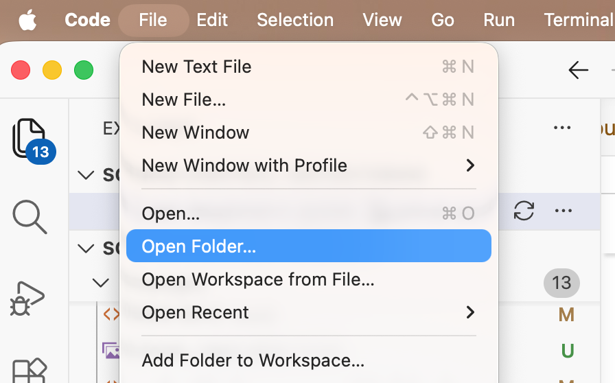
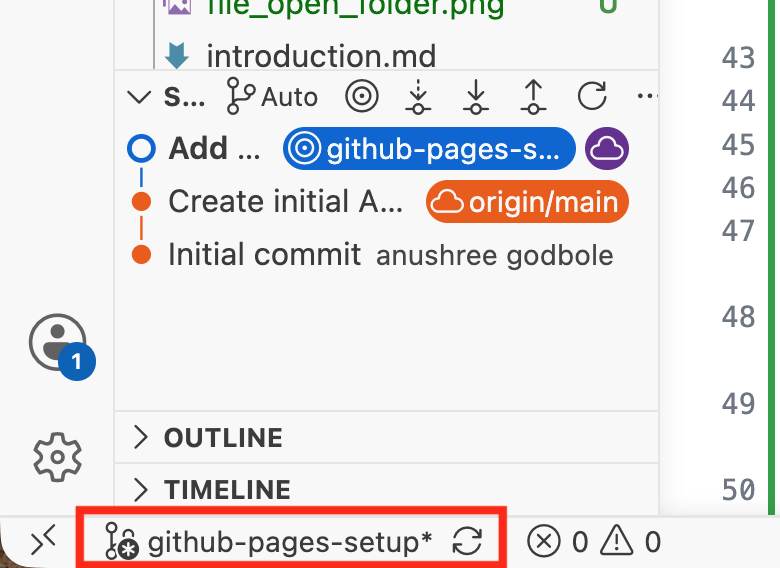
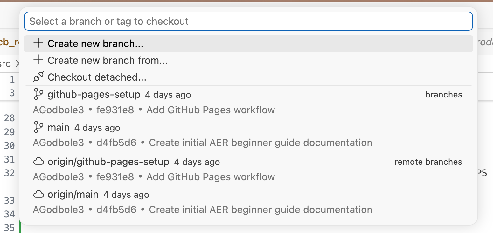
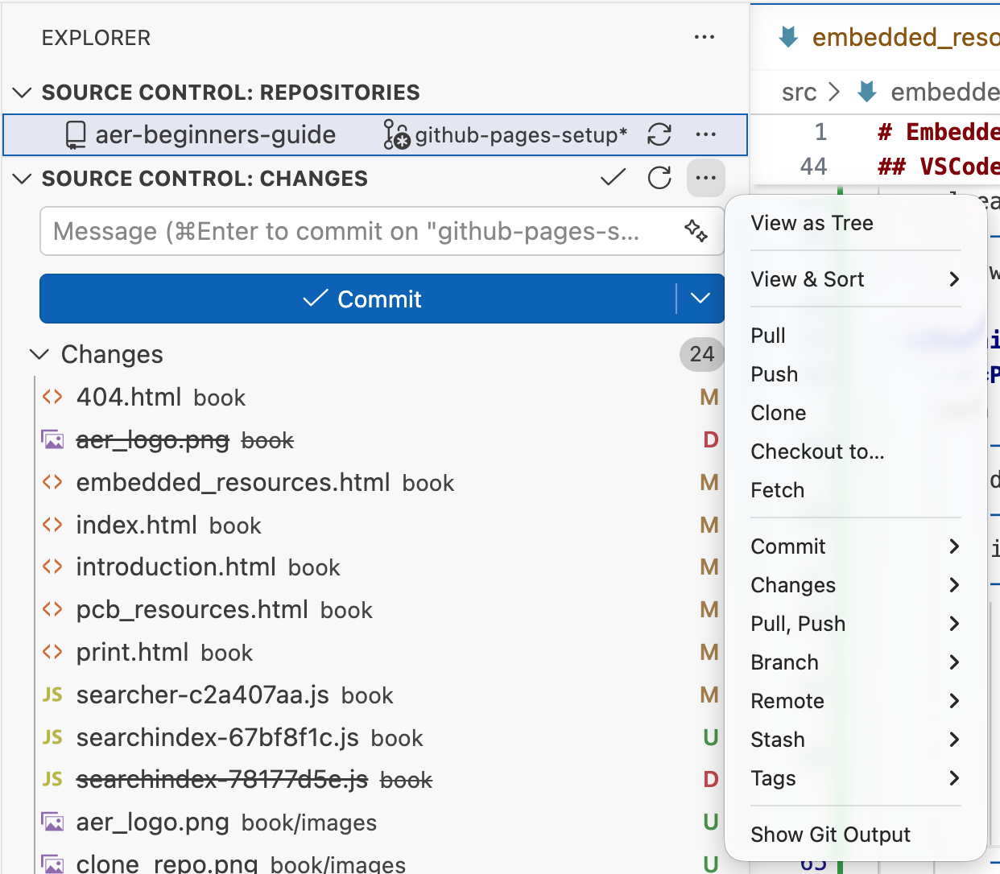
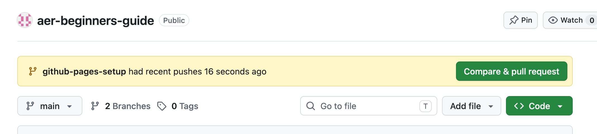
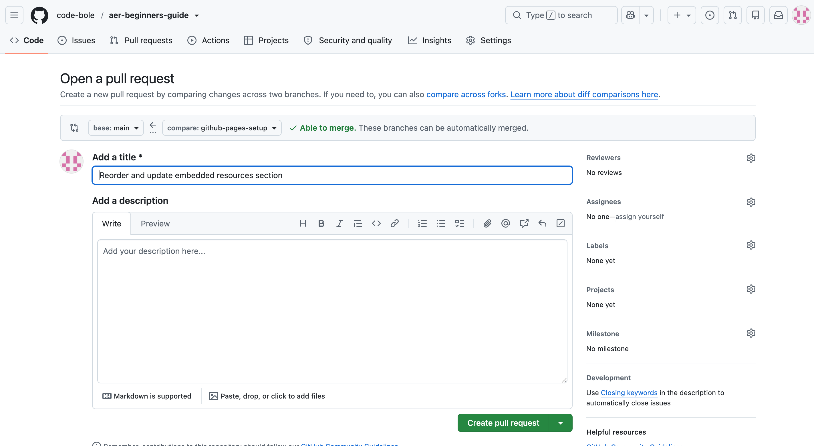

# Embedded Resources

- ### [MegaZott's Embedded Repository](https://github.com/Anteater-Electric-Racing/embedded-mz)
## Git Basics

- **Git**: a version control system that tracks changes to code and allows multiple people to collaborate on the same project

- We mainly use GitHub (which is built around Git) to store all of our files
    - Allows us to see past changes, updated changes, and it’s easy to keep track of who changed what
- **Repository (repo)**: think of it like a container to store all of our car related files
    - **Cloning a repository**: when you want to make changes to a repository in an IDE, you'll have to make a copy of that repository on your personal device (hence, cloning)
        - This allows you to make changes locally (on your device) before you publish those changes to GitHub for your collaborators to see
- **Branches**: each repository has branches, and they allow you to make changes to code without changing the main source code
    - Each repo (by default) has a main branch, where the main source code is
    - Each new branch starts from the current state of the branch it's created from (usually main)
    - You can make edits on the new branch and it won’t affect the code in the main branch, until you “merge” into main
    - Importance of branches: lets you change code without directly affecting the main code base, and is more easily undoable 
- **Pulling changes**: downloads the latest changes from GitHub into your local copy of the repository
- **Pushing changes/committing changes**: means “pushing” your code to a branch, and your changes will show up in that branch with an optional commit message that you enter
- **Pull requests (PR)**: a form you fill out with a quick description of your changes in the code
    - Allows reviewers to check over your code to give you feedback and request any changes
    - Once approved, your code will be merged to main
    - Reviewers can post comments on the pull request to request changes/fixes to your code
    

## GitHub and VSCode
- Sign in to GitHub through VSCode

- Hit "Clone Git Repository" on the Welcome page and copy and paste over the HTTPS link from the repository itself

    

- Select a destination to clone your repository locally (somewhere on your computer where you won't lose it). Yay, now you have a local copy of that repository on your laptop and you can edit it freely!

- When you want to open that repo in VSCode, hit "File" and then "Open Folder" and open the folder associated with the cloned repository

    

- Now you're ready to code! Feel free to make any code changes here, no one will be able to see them unless you push your changes to GitHub

## VSCode Basics
- First step: open a cloned repository on your VSCode (see above section)

- **Switching or creating a new branch**: In the bottom left corner, you should see the current branch that you're on

    
    - If you click on the branch name, you'll see a menu in the search bar that says "Select a branch or tag to checkout"

        

    - Here, you can create a new branch or select one that you've already made (if creating, type the new branch's name in the box)
        - If you create a new branch and publish it on VSCode, you will see the changes reflected on GitHub as well

- **Pushing and pulling changes**: 
    - **Pulling changes**: click on the branch split with circles icon in the left sidebar
        - Hover over "Source Control: Changes" and click on the 3 dots to the right
        - You'll see multiple options here, but the two most important are "Fetch" and "Pull":

            

        - Use **"Fetch"** when:
            - You want to see what new changes there are without automatically changing your files
            - You have uncommitted work and don't want to cause merge conflicts
                - **Merge conflict**: occurs Git gets confused because two people changed the exact same lines of code, and doesn't know which version to keep

        - Use **"Pull"** when:
            - You're just starting work for the day and want the absolute latest code
            - Warning: the "Pull" action will cause your files to be automatically updated with the latest code and could force you to deal with merge conflicts

    - **Pushing/Commiting changes**: In the same source control section, you'll see an empty box that says "Message..."

        - This box is for your **commit message**, which describes what changes you made at a glance
            - Ex: Create initial AER beginner guide pages documentation, Add GitHub pages workflow
            - Message is supposed to make it easier to see which changes are associated with which commit
        - When you're done with your message, hit the "Commit" button, and then hit "Sync" to sync your changes to GitHub

## How to Make Code Changes and Create a Pull Request

- Create a new branch with the naming format: FirstinitialLastinitial/task (if multiple names, hyphenate the initials)
    - Ex: ag-dt/speaker

- Make sure you are making your changes in the branch you just created and NOT main (you shouldn't be able to push your changes to main anyways)
    - When you're done with all of your changes, make sure to commit. Now you're ready to open a Pull Request (PR)!

- Go back to GitHub: when you visit the repository, you should see a bright green button that says "Compare & pull request"

    

- Fill out the PR according to the PR template (it should autopopulate, but if it doesn't just check the PULL_REQUEST_TEMPLATE file)
    - Add Anoop as a reviewer and assign yourself + your partner on the PR/task

    - **Note: The picture shown below is a PR in a different repository (not associated with AER) so the PR template doesn't populate there**
    
    

    - Create the PR, and shoot a DM to Anoop about it

    - Wait until you get comments or until your changes are merged into main

    - Once your changes are merged, make sure to go back and delete the branch you previously created (to reduce clutter)

## Typical Git Workflow
1. Pull the latest changes from main

2. Create a new branch using the naming convention above

3. Switch to that branch and make any changes to that code

4. Commit your changes with a descriptive message

5. Open a Pull Request + wait for your code to be reviewed

6. Address any review comments and make changes if needed

7. Once your code is merged to main, delete your branch

8. Celebrate!


## General Embedded Info
- At the end of each quarter, we’re all required to update our embedded documentation for whatever we worked on in [this repo](https://github.com/Anteater-Electric-Racing/aer-documentation)

    - Great way to get in-depth knowledge of everything embedded (though it can be dense at times)

    - We use Markdown to write this, and you can run it locally on your laptop to see the rendered changes
    - To run the local rendered markdown page and develop first enter: <br>
    ```curl https://sh.rustup.rs -sSf | sh in your terminal```
    - Install mdbook:
    ```cargo install mdbook mdbook-mermaid```
    - Clone the aer-documentation repo (or whichever one we’re using at the time) and then run: <br>
    ```git clone https://github.com/Anteater-Electric-Racing/aer-documentation``` <br>
    ```cd aer-documentation``` <br>
    ```mdbook serve```
        - **git clone** → clones repo in git
        - **cd** → means “change directory” to aer-documentation (or whatever the name of the repo is)
    - Go to [http://localhost:3000/](http://localhost:3000/) to see the rendered changes


