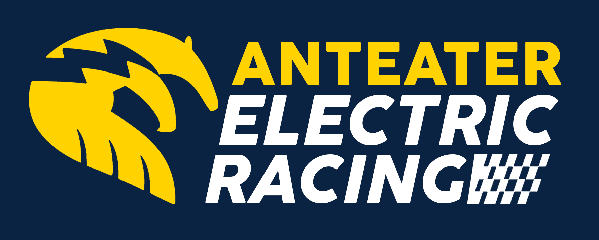

# AER Resources

  

 

 > **Welcome to the team!** These pages are a rough guide to help you get started learning what you need to know when joining AER's Electrical (PCB) or Embedded teams!

### About Me
Hi! My name is Anushree Godbole, and I'm a Computer Engineering sophomore. This is going to be my second year at AER! I'm specifically part of the **Electrical (PCB Design) team** and the **Embedded team**. 
### Why I Made This Guide
I've compiled some of my learnings here in order to help out new joinees! I came in not knowing much about both PCB design or Embedded work, so I know it can be quite overwhelming to learn at times. I'm hoping this will be a good resource to get you a head start! 

Happy reading! :)
